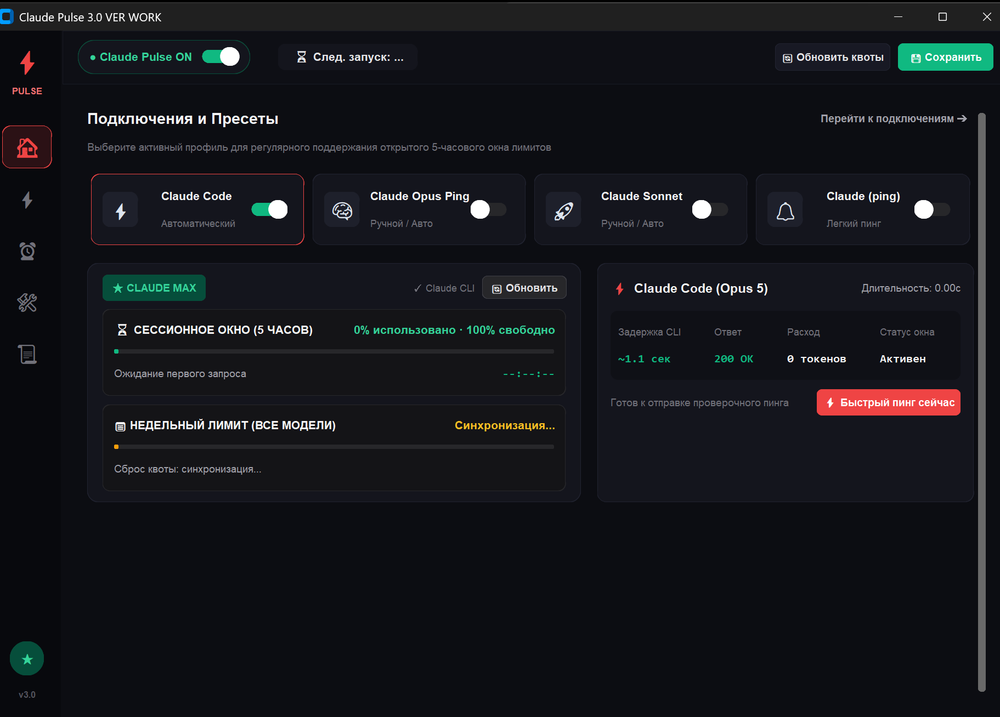

<div align="center">

# ⚡ Claude Pulse 3.0

**Интеллектуальный менеджер сессий и квот для Claude Code CLI с дизайном в стиле ExitLag Dark**

[](https://github.com/VvVampirevvV/ClaudePulse)
[](https://www.python.org/)
[](https://github.com/TomSchimansky/CustomTkinter)
[](LICENSE)
[](https://github.com/VvVampirevvV/ClaudePulse/releases)

<p align="center">
  
</p>

</div>

---

## 📖 О проекте (Overview)

**Claude Pulse** — это специализированное настольное приложение для Windows, предназначенное для разработчиков, активно использующих **Claude Code CLI** (Anthropic). 

Главная цель приложения — **автоматически удерживать 5-часовое сессионное окно лимитов открытым**, предотвращать простои в работе из-за Rate Limit и предоставлять детальный живой мониторинг официальных квот прямо на рабочем столе.

Интерфейс спроектирован в эстетике киберспортивного игрового дашборда **ExitLag**: глубокая тёмная тема (`#0c0d12`), неоновые акценты (`#ef4444` Coral Red и `#10b981` Emerald Green), плавная навигация и наглядные метрики.

---

## ✨ Ключевые возможности (Features)

### 📊 1. Живой парсер квот и 5-часового сессионного окна
* **Авто-парсинг Claude CLI:** выполняет безопасный запрос `claude /usage` без расхода пользовательских рабочих токенов.
* **5-часовое сессионное окно:** наглядный прогресс-бар, процент расхода и оставшегося запаса, таймер обратного отсчета до сброса лимита.
* **Недельный лимит:** отслеживание суммарной недельной квоты по всем моделям и Fable, дата и точное время сброса (Europe/Moscow).
* **Сводка профиля:** отображение текущего тарифного плана (`★ CLAUDE MAX`), авторизованного email и рабочей модели.

### 🎛️ 2. Мастер-рубильник и фоновый демон
* **ExitLag ON/OFF Switch:** верхний тумблер в шапке окна позволяет в один клик поставить фоновый планировщик на паузу или возобновить его.
* **Сворачивание в системный трей:** программа бесшумно работает в фоновом режиме около системных часов.
* **Single Instance Guard:** встроенная защита на уровне системного мьютекса ядра Windows (`Win32 Named Mutex`) — предотвращает случайный параллельный запуск дубликатов процесса. При повторном клике по ярлыку разворачивает уже активное окно.

### ⏰ 3. Гибкий планировщик запусков (Scheduler)
* **Режим фиксированного времени:** запуск в заданные часы каждый день (например, в `08:00`, `13:00`, `18:00`).
* **Режим интервалов:** автоматический проверочный пинг каждые `N` часов (например, каждые 4.5 часа для непрерывной фиксации сессии).
* **Календарь дней недели:** индивидуальный выбор активных дней (`Пн`–`Вс`).
* **Интеллектуальный Countdown:** динамический бейдж `⏳ След. запуск: ЧЧ:ММ:СС` с авто-обновлением каждую секунду.

### 🧩 4. Профили и пресеты подключений
* Быстрое переключение рабочих профилей в виде интерактивных карточек:
  * ⚡ **Claude Code** (`claude -p "ок"`) — стандартный быстрый вызов.
  * 🧠 **Claude Opus Ping** (`claude -p "ок" --model opus`) — фиксация окна для модели Claude 3 / 3.5 / 3.7 Opus (0 токенов расхода).
  * 🚀 **Claude Sonnet** (`claude -p "ок" --model sonnet`) — экономный вызов для модели Sonnet.
  * 🔔 **Claude (ping)** (`claude -p "ping"`) — легковесный фоновый пинг.
  * 💻 **Cursor CLI** / **Aider** / **Пользовательская команда** — поддержка любого терминального AI-ассистента.
* Удобный выбор рабочей директории проекта через проводник Windows.
* Кнопка немедленной тестовой проверки `[⚡ Проверить сейчас]`.

### 🛠️ 5. Системные твики Windows (System Tweaks)
* **🖥️ Автозапуск с Windows:** автоматический тихий старт в системный трей при включении компьютера.
* **⚡ Пробуждение ПК (Wake PC):** вывод компьютера из спящего режима по системному таймеру Windows для отправки запланированного пинга.
* **🔔 Windows Notifications:** нативные всплывающие уведомления Windows Toast о сбросе квот и статусе сессий.
* **🛡️ Скрытый режим консоли (Silent Mode):** выполнение консольных CLI-команд в фоновом потоке без мерцания черных окон `cmd.exe`.
* **⏱️ Наверстывание пропущенных запусков:** мгновенный пинг при включении, если ПК был выключен во время назначенного расписания.

### 💡 6. Адаптивные подсказки (DPI-Aware Tooltips)
* Все кнопки, переключатели и метрики снабжены подробными подсказками на понятном языке.
* Поддержка экранов любого разрешения (Full HD, 2K, 4K) с автоматическим масштабированием шрифтов (100%–250% DPI).
* Архитектура **Zero-Lag Singleton**: подсказки никогда не залипают, не перегружают процессор и мгновенно скрываются при уходе курсора.

---

## 🚀 Установка и быстрый старт (Installation)

### Вариант 1. Запуск готового EXE (Рекомендуется)
1. Перейдите в раздел [Releases](https://github.com/VvVampirevvV/ClaudePulse/releases) или папку `dist/`.
2. Скачайте файл **`ClaudePulse.exe`**.
3. Запустите программу — установка не требуется, приложение портативно и готово к работе!

### Вариант 2. Запуск из исходного кода (Python)
Требуется **Python 3.10** или новее.

```bash
# 1. Клонируйте репозиторий
git clone https://github.com/VvVampirevvV/ClaudePulse.git
cd ClaudePulse

# 2. Установите зависимости
pip install -r requirements.txt

# 3. Запустите приложение
python main.py
```

### Сборка собственного бинарника (Build EXE):
```bash
python build.py
```
Готовый исполняемый файл будет скомпилирован в папку `dist/ClaudePulse.exe`.

---

## 🛠️ Стек технологий (Tech Stack)

| Компонент | Технология | Назначение |
| :--- | :--- | :--- |
| **Язык** | Python 3.10+ (совместим с 3.14) | Основная логика приложения |
| **GUI Framework** | CustomTkinter | Современный тёмный векторный интерфейс |
| **Системный трей** | pystray & Pillow | Интеграция в область уведомлений Windows |
| **Планировщик** | Custom Threaded Scheduler | Точный фоновый тайминг с поддержкой сна ПК |
| **Системная интеграция** | Windows Win32 API (`ctypes`) | Mutex, DPI-Awareness, управление окнами |
| **Уведомления** | Windows Toast API | Нативные всплывающие карточки Windows 10/11 |
| **Компиляция** | PyInstaller | Сборка в один независимый `.exe` |

---

## 📂 Структура проекта (Project Structure)

```
ClaudePulse/
├── assets/                  # Иконки приложения (.ico)
│   ├── icon.ico             # Стандартная иконка в стиле ExitLag Pulse
│   └── icon_active.ico      # Иконка активного состояния
├── src/
│   ├── ui/
│   │   ├── components.py    # Виджеты: квоты, карточки, метрики, ToolTip
│   │   ├── main_window.py   # Главное окно, дашборд, сайдбар, страницы
│   │   └── tray.py          # Логика системного трея Windows
│   ├── autostart.py         # Реестр Windows (Run-ветка автозапуска)
│   ├── claude_parser.py     # Парсер квот и лимитов из Claude Code CLI
│   ├── config.py            # Управление конфигурацией (%APPDATA%\ClaudePulse)
│   ├── notifications.py     # Windows Toast уведомления
│   ├── runner.py            # Бесшумный запуск CLI команд без всплывающих окон
│   ├── scheduler.py         # Многопоточный движок расписания и сна
│   └── single_instance.py   # Защита от дубликатов через Win32 Named Mutex
├── build.py                 # Скрипт автоматической компиляции PyInstaller
├── ClaudePulse.spec         # Спецификация сборки PyInstaller
├── requirements.txt         # Список зависимостей Python
├── screenshot.png           # Скриншот интерфейса
└── main.py                  # Главная точка входа
```

---

## ⚙️ Конфигурация (Configuration)

Настройки программы автоматически сохраняются в формате JSON по пути:
```
%APPDATA%\ClaudePulse\config.json
```
Пример конфигурации:
```json
{
  "master_enabled": true,
  "mode": "fixed",
  "times": ["08:00", "13:00", "18:00"],
  "interval_hours": 4.5,
  "days": ["Пн", "Вт", "Ср", "Чт", "Пт", "Сб", "Вс"],
  "active_preset": "Claude Opus Ping",
  "command": "claude -p \"ок\" --model opus",
  "working_dir": "C:\\Projects",
  "wake_pc": false,
  "autostart": false,
  "notifications": true,
  "hidden_console": true,
  "catchup_missed": true,
  "anthropic_sync": true
}
```

---

## 👤 Автор (Author)

* **Vv.Vampire.vV** ([@VvVampirevvV](https://github.com/VvVampirevvV))

---

## 📄 Лицензия (License)

Проект распространяется под открытой лицензией [MIT License](LICENSE).
Вы можете свободно использовать, модифицировать и распространять данный код.
